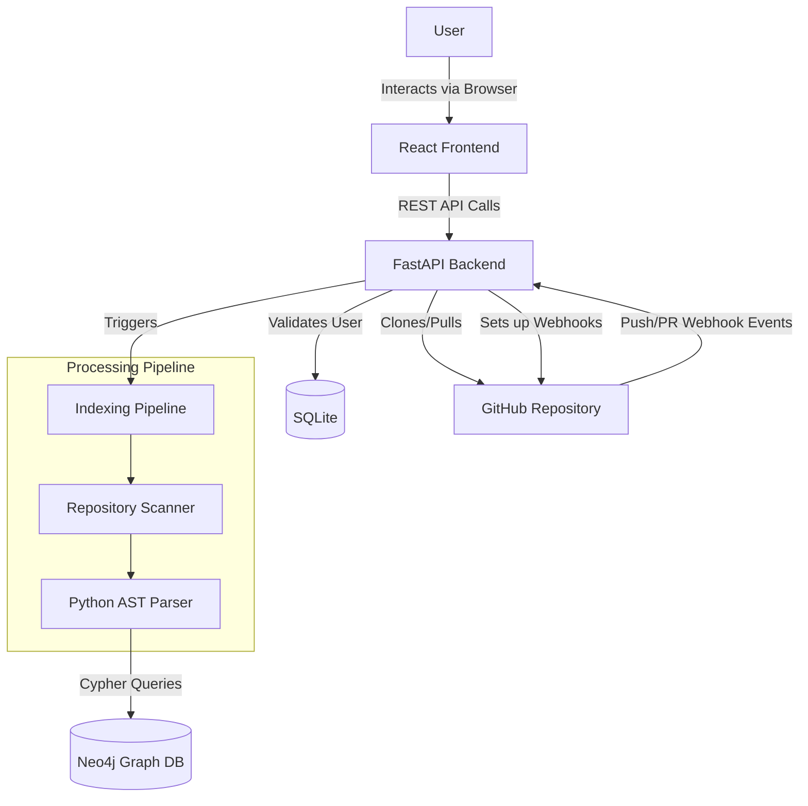
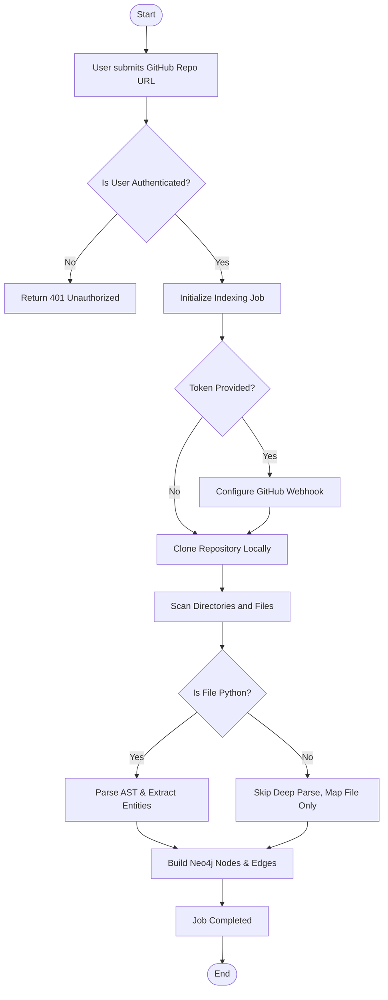

# MergeMind - Codebase Brain API

## 1. Executive Summary
MergeMind is an AI-driven Agent Pull Request (PR) Management Platform designed to automate code reviews and repository management. The project is being developed in two major phases. Phase 1 (completed) focuses on generating deep repository context by parsing Python source code into a Neo4j Graph Database ("Codebase Brain"), which provides a structural understanding of the codebase. Phase 2 (upcoming) will introduce the main AI Agent, which will utilize this graph context to autonomously review, manage, and merge pull requests based on real-time GitHub webhook events. The system currently includes a React-based frontend for interacting with the graph data and a FastAPI backend handling asynchronous indexing, webhooks, and authentication.

## 2. Problem Statement
Reviewing and managing Pull Requests (PRs) in large, complex codebases is a highly manual, time-consuming process prone to human error. While AI coding assistants have emerged to help write code, they typically lack global repository context. When tasked with reviewing PRs or suggesting architectural changes, AI agents often hallucinate or suggest code that breaks unseen dependencies because they only analyze isolated files rather than the entire structural graph of the codebase.

## 3. Background / Existing System
Currently, development teams rely on manual peer reviews for PRs, which bottlenecks the software delivery lifecycle. Existing AI tools (like standard LLMs or basic coding copilots) rely on limited context windows and standard text search (e.g., RAG over text files). They do not possess a deterministic, structural understanding of how functions, classes, and modules depend on one another. Without a queryable graph representation of the codebase, AI agents cannot reliably automate the PR lifecycle or perform safe, context-aware code reviews.

## 4. Problems in the Existing System
- **Manual PR Reviews:** Code reviews are highly manual, time-consuming, and prone to human error, slowing down the development lifecycle.
- **AI Hallucinations due to Lack of Context:** Current AI coding assistants and agents lack global repository context. When managing PRs, they often suggest changes that break unseen dependencies because they only view files in isolation.
- **Hidden Dependencies:** It is difficult for reviewers (and AI) to see which files are impacted by a change in a core utility class without an architectural map.
- **Lack of Automated PR Management:** Teams lack a centralized, context-aware agent that can automatically triage, review, and handle pull requests based on structural code rules.

## 5. Proposed Solution
MergeMind proposes a two-phased solution to achieve autonomous PR management:
- **Phase 1: The Codebase Brain (Completed):** By directly cloning a repository, scanning its files, and parsing the source code into an Abstract Syntax Tree (AST), the system extracts entities and relationships. This data is stored in a Neo4j Graph Database, forming a queryable, real-time context layer kept up-to-date via GitHub webhooks.
- **Phase 2: The Main AI Agent (Upcoming):** Using the graph as its foundational context, a sophisticated AI Agent will be introduced. This agent will listen to PR webhook events, query the Neo4j graph to understand the global impact of the PR, perform automated reviews, suggest architectural fixes, and manage the PR lifecycle autonomously.

## 6. Project Objectives
- **Primary Objective:** To develop an autonomous AI Agent capable of managing and reviewing Pull Requests with global codebase context.
- **Secondary Objectives:** Build a "Codebase Brain" (Neo4j graph) to provide the AI agent with deep structural context (Completed).
- **Functional Objectives:** Support GitHub webhook integration to keep the graph updated and to trigger the AI agent on PR events.
- **Technical Objectives:** Implement a robust architecture separating relational user data (SQLite), codebase architecture data (Neo4j), and the upcoming LLM processing layer.

## 7. Scope of the Project
The project is divided into Phase 1 (Context Generation) and Phase 2 (Agent Creation).
The **current scope (Phase 1 completed)** includes:
- User authentication and session management via JWT.
- Ingestion of GitHub repositories and AST parsing for Python source code.
- Graph storage of entities and dependencies in Neo4j.
- Real-time event handling for GitHub Webhooks (push, pull_request).
- A frontend UI for dashboard statistics.

The **future scope (Phase 2)** includes:
- Development of the main AI PR Management Agent.
- Agentic interaction with the Neo4j graph for PR reviews.

## 8. Key Features
1. **User Authentication:** Secure registration and login using JWT and hashed passwords.
2. **Repository Ingestion:** Background processing pipeline to clone, scan, and parse repositories.
3. **AST Graph Mapping:** Automated extraction of classes, functions, endpoints, and relationships.
4. **Dashboard Analytics:** Viewing repository statistics (files, entities) and active pull requests.
5. **Real-time Webhook Sync:** HMAC-secured endpoints that update the Neo4j graph when code is pushed or PRs are opened/closed.

## 9. Detailed Feature Implementation

### Feature 1: User Authentication
**Purpose:** Secures the application and associates API usage with specific users.
**User Flow:** User registers or logs in via the React frontend. On success, they receive a JWT and are redirected to the Dashboard.
**Frontend Implementation:** `LoginPage.jsx`, `AuthContext.jsx` for state management.
**Backend Implementation:** `api/auth.py` router handling `/register`, `/login`, and `/me`.
**Database Interaction:** Stores user records in SQLite using SQLAlchemy (`User` model).
**Validation:** Pydantic models enforce email formatting and password requirements.
**Technologies Used:** passlib, python-jose, FastAPI.

### Feature 2: Repository Ingestion & Parsing
**Purpose:** The core engine that converts source code into graph data.
**User Flow:** User enters a GitHub URL (and optional token) on the Setup page. The system returns a job ID while processing in the background.
**Frontend Implementation:** `ProjectSetupPage.jsx`.
**Backend Implementation:** `api/brain.py` triggers `IndexingPipeline` which utilizes `RepositoryScanner` and `PythonASTParser`.
**Database Interaction:** Connects to Neo4j to create `Repository`, `Directory`, `File`, `Class`, `Function`, and `Endpoint` nodes.
**Technologies Used:** GitPython, Python `ast` module, Neo4j Python Driver.

### Feature 3: GitHub Webhooks Integration
**Purpose:** Keeps the Codebase Brain synchronized without manual re-indexing.
**User Flow:** The backend automatically configures the webhook on GitHub using the provided token during ingestion.
**Backend Implementation:** `api/webhooks.py` listens for `push` and `pull_request` events. Uses `verify_github_signature` for HMAC security.
**Database Interaction:** Merges new nodes or triggers re-scans in Neo4j based on events.
**Technologies Used:** PyGithub, HMAC SHA-256.

## 10. Technology Stack

### Frontend
- **Framework:** React 19
- **Build Tool:** Vite
- **Styling:** TailwindCSS 4.3
- **Routing:** React Router v7
- **Icons:** Lucide React
- **API Communication:** Axios

### Backend
- **Programming Language:** Python
- **API Framework:** FastAPI
- **Server:** Uvicorn
- **Authentication:** JWT (python-jose), Passlib (bcrypt)
- **Validation:** Pydantic v2
- **ORM:** SQLAlchemy (for relational data)
- **AST Parsing:** Native Python `ast` module

### Database
- **Graph Database:** Neo4j (Codebase architecture storage)
- **Relational Database:** SQLite (User accounts and local metadata)

### DevOps / Deployment
- **Containerization:** Docker & Docker Compose (used for Neo4j instance provisioning)
- **Version Control:** Git, GitHub integration

## 11. System Architecture
The application follows a client-server architecture with a hybrid database approach:

```text
User Browser (React UI)
 ↓ (Axios HTTP Requests)
API Layer (FastAPI Routers)
 ↓
Business Logic (Auth Core, Indexing Pipeline, Parsers)
 ↙                                       ↘
Data Access (SQLAlchemy)              Graph Access (Neo4j Driver)
 ↓                                       ↓
SQLite Database (Users)               Neo4j Database (Codebase Nodes/Edges)
```

## 12. Complete System Flow
1. **User Action:** User submits a GitHub URL on the frontend.
2. **React Component:** `ProjectSetupPage` sends a POST request to `/api/brain/index`.
3. **Backend Controller:** `brain.py` receives the request, sets up a webhook via GitHub API, and spawns a background thread.
4. **Service:** `IndexingPipeline` clones the repo, scans the file tree, and loops through files.
5. **Parser:** Python files are fed into `PythonASTParser` to extract structural metadata.
6. **Graph Builder:** Metadata is passed to `NodeBuilder` and `RelationshipBuilder`.
7. **Database:** Neo4j stores the nodes and edges.
8. **Frontend State:** The frontend polls for status and updates the UI upon completion.

## 13. UML Flow Diagram



## 14. Activity Diagram



## 15. Project Structure

- **`backend/`**: Python FastAPI application.
  - **`app/api/`**: API route controllers (`auth.py`, `brain.py`, `webhooks.py`).
  - **`app/brain/`**: Core graph logic, indexing pipelines, and PR webhook handlers.
  - **`app/core/`**: Configuration, security (HMAC), JWT auth logic.
  - **`app/graph/`**: Neo4j client connection and graph builders.
  - **`app/ingestion/`**: Git repository cloning and file scanning.
  - **`app/models/`**: SQLAlchemy models (`user.py`) and Pydantic schema representations.
  - **`app/parsers/`**: Language-specific parsers (`python_parser.py`).
- **`frontend/`**: React application.
  - **`src/pages/`**: UI views (Login, Dashboard, Setup, Architecture).
  - **`src/context/`**: React context for state management (`AuthContext`).
- **`docker-compose.yml`**: Infrastructure setup for Neo4j.

## 16. Module-Wise Explanation

1. **Auth Module (`backend/app/api/auth.py`, `backend/app/core/auth.py`)**: Handles password hashing, JWT generation, and SQLAlchemy user querying.
2. **Ingestion Module (`backend/app/ingestion/`)**: Responsible for fetching the code using GitPython (`repository_manager.py`) and recursively mapping the directory tree (`scanner.py`).
3. **Parser Module (`backend/app/parsers/`)**: Contains the `PythonASTParser`, which traverses the Python Abstract Syntax Tree to identify class definitions, function definitions, imports, and web framework decorators (e.g., `@app.get`).
4. **Graph Module (`backend/app/graph/`)**: Abstraction layer for Neo4j. Converts parsed python dictionaries into parameterized Cypher queries to create nodes (`NodeBuilder`) and edges (`RelationshipBuilder`).

## 17. Frontend Architecture
The frontend uses a Context API-based architecture for authentication (`AuthContext.jsx`), wrapping the application routing. React Router is used to segregate `GuestRoute`s (login/register) from `ProtectedRoute`s (dashboard). The UI is built entirely with TailwindCSS, utilizing dynamic flexbox and grid layouts.

## 18. Backend Architecture
The backend leverages FastAPI's Dependency Injection system extensively (e.g., injecting the database session via `Depends(get_db)` or the current user via `Depends(get_current_user)`). The indexing system is decoupled from the request-response cycle, executing in a background thread to prevent HTTP timeouts during large repository clones.

## 19. Database Design

### SQLite (Relational)
- **Table:** `users`
- **Fields:** `id` (UUID, Primary Key), `username` (String, Unique), `email` (String, Unique), `hashed_password` (String), `is_active` (Boolean).

### Neo4j (Graph)
- **Nodes:**
  - `Repository` (id, name, github_url)
  - `Directory` (id, path, name)
  - `File` (id, path, name, extension, language, line_count)
  - `Class` (id, name, docstring, start_line)
  - `Function` (id, name, docstring)
  - `Endpoint` (id, method, path)
  - `PullRequest` (pr_number, title, author, status)
- **Relationships:**
  - `(Repository)-[:CONTAINS]->(Directory|File)`
  - `(Directory)-[:CONTAINS]->(Directory|File)`
  - `(File)-[:DEFINES]->(Class|Function)`
  - `(Class)-[:INHERITS]->(ParentClass)`
  - `(Class)-[:HAS_METHOD]->(Function)`
  - `(PullRequest)-[:TARGETS]->(Repository)`
  - `(File)-[:IMPORTS]->(Module)`

## 20. API Documentation

| Method | Endpoint | Purpose | Request Body | Response | Authentication |
| ------ | -------- | ------- | ------------ | -------- | -------------- |
| POST | `/api/auth/register` | Create a new user | `{username, email, password}` | `{access_token, user}` | None |
| POST | `/api/auth/login` | Authenticate user | `{email, password}` | `{access_token, user}` | None |
| GET | `/api/auth/me` | Fetch active profile | None | `{id, username, email}` | JWT Required |
| POST | `/api/brain/index` | Start parsing a repo | `{project_name, repo_url, token}` | `{job_id, status}` | None (currently open) |
| GET | `/api/brain/dashboard` | Fetch repo statistics | Query: `repo_url` | `{active_prs, stats}` | None (currently open) |
| POST | `/api/webhooks/github` | Receive GitHub events | Raw JSON payload | Webhook Status | HMAC-SHA256 Sig |

## 21. Authentication and Authorization
Authentication is implemented via JSON Web Tokens (JWT). Passwords are cryptographically hashed using `bcrypt` via the `passlib` library before being stored in SQLite. Protected backend routes require a valid `Bearer` token in the `Authorization` header, which is decoded and validated to inject the `current_user` object into the request context.

## 22. Validation and Error Handling
FastAPI automatically applies input validation based on Pydantic schemas. For example, `RegisterRequest` ensures the email string conforms to a valid email structure using `pydantic[email]`. Backend logic manually raises `HTTPException`s (e.g., 409 Conflict if an email already exists, or 401 Unauthorized for bad passwords), which FastAPI translates into JSON error responses.

## 23. Important Algorithms / Business Logic
**AST Traversal and Endpoint Detection:**
The `PythonASTParser` extends the native `ast.NodeVisitor`. As it traverses function definitions (`ast.FunctionDef`), it inspects the decorator list. If it finds a decorator corresponding to HTTP methods (e.g., `@app.get("/route")` or `@router.post`), it flags the function as an API endpoint, extracting the HTTP method and route path. This allows the graph to not just map code structure, but API surface area.

## 24. Intelligent / Automated Processing & AI Agent Strategy
**Current Automation (Phase 1):** The system features highly automated reactive processing. When a developer pushes code or opens a PR, GitHub fires a webhook payload. MergeMind automatically schedules an incremental update, fetching only modified files and merging the updated AST structure into Neo4j, ensuring the Codebase Brain is perpetually accurate.
**Upcoming AI Integration (Phase 2):** This real-time graph serves as the foundation for the upcoming AI Agent. By querying Neo4j, the main LLM-powered agent will possess a deterministic understanding of how PR changes affect the broader system, allowing it to provide highly accurate, context-aware code reviews and PR management without the hallucination issues common in standard text-based LLM coding tools.

## 25. Request-Response Flow
*Flow for authenticating and fetching dashboard data:*
1. **User Action:** Logs in successfully, saves JWT to React context.
2. **React Component:** Dashboard mounts, Axios sends a GET request to `/api/brain/dashboard?repo_url=...` with the `Authorization: Bearer <token>` header.
3. **FastAPI Route:** Validates the JWT, extracting user ID.
4. **Service:** Queries the Neo4j session using Cypher: `MATCH (r:Repository)...`
5. **Response:** Backend aggregates total files, total entities, and active PRs into a JSON dictionary and responds with HTTP 200.
6. **Frontend State:** React state updates, populating the UI statistics cards.

## 26. Testing
Currently, the repository sets up a foundational architecture but lacks implemented automated test suites. While the `pytest` framework is included in the backend `requirements.txt`, no test files or directories currently exist in the codebase.

## 27. Security
- **Data Protection:** Passwords are never stored in plaintext (bcrypt).
- **Session Security:** JWTs are used for stateless authentication.
- **Webhook Security:** The `/api/webhooks/github` endpoint enforces strict security by reconstructing the HMAC-SHA256 hash using the raw request body and the server's private secret, verifying it against GitHub's `X-Hub-Signature-256` header to prevent payload spoofing.

## 28. Performance and Scalability
- **Implemented Optimizations:** The heavy task of cloning and parsing repositories is offloaded to a background thread to prevent HTTP blocking. The Neo4j client utilizes a connection pool rather than opening a new connection per query.
- **Scalability:** Separating relational user data into SQLite and heavy graphical data into Neo4j allows the graph database to be scaled independently.

## 29. Technical Challenges and Solutions
- **Challenge:** Creating unique, deterministic IDs for graph nodes across multiple repositories to avoid data collisions.
- **Solution:** Node IDs are constructed hierarchically. For example, a class node ID uses the format `class:{repo_id}:{file_path}:{class_name}`. This ensures idempotency; if the pipeline runs twice, the Neo4j `MERGE` command safely updates the existing node instead of duplicating it.
- **Challenge:** Parsing code safely without executing it.
- **Solution:** Python's native `ast` module was utilized, allowing the system to understand code semantics strictly statically, avoiding the severe security risks of executing untrusted repository code.

## 30. Limitations
- **Language Support:** Currently, AST parsing is hardcoded strictly for Python. Other languages are only mapped at the file/directory level.
- **Frontend Visualization:** While the `ArchitecturePage.jsx` exists, it currently displays a static placeholder. Dynamic graph visualization libraries are not yet integrated.
- **Database:** SQLite is used for user data, which is not suitable for high-concurrency production deployments.

## 31. Future Enhancements
- **Development of the Main AI PR Agent (Phase 2 Focus):** Build the core LLM agent that listens to PR webhooks, analyzes diffs against the Neo4j graph, and posts automated, context-aware code reviews directly to GitHub.
- **Interactive UI Graph:** Integrate `react-force-graph` to render the Neo4j nodes visually in the React frontend.
- **Multi-language Support:** Implement parsers for JavaScript/TypeScript and Java/C# utilizing tools like Tree-sitter to expand the Agent's capabilities beyond Python.
- **Agentic RAG:** Combine the Neo4j Graph (GraphRAG) with a Vector Database so the PR Agent can understand both the structural dependencies and semantic meaning of the code.

## 32. Project Outcome
MergeMind successfully proves the concept of converting unstructured, text-based source code into a highly structured, queryable knowledge graph. By automating ingestion and integrating directly with GitHub webhooks, the system maintains a real-time architectural blueprint of a software project.

## 33. Conclusion
MergeMind provides a modern, structural approach to codebase comprehension. By shifting from text-based search to graph-based traversal, developers gain the ability to answer complex architectural questions programmatically. The foundation built with FastAPI, Neo4j, and React provides a robust platform for future enhancements, including AI-driven code analysis and visual architecture mapping.

## 34. References / Technologies Used
- **React Documentation:** https://react.dev/
- **FastAPI Documentation:** https://fastapi.tiangolo.com/
- **Neo4j Cypher Manual:** https://neo4j.com/docs/cypher-manual/current/
- **Python AST Module:** https://docs.python.org/3/library/ast.html
- **TailwindCSS:** https://tailwindcss.com/
